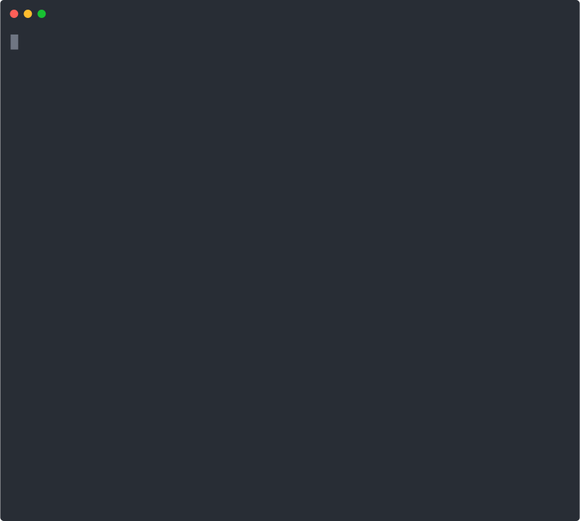

<!--

-->

# Babble

An upgrade routine for Homebrew, Mac App Store and macOS

## Example session



## Install

```shell
# Download the script
curl --silent "https://raw.githubusercontent.com/toobuntu/babble/main/bbl" --output "<path>/bbl" && chmod +x "<path>/bbl"
# Run it
"<path>/bbl"
```

Change `<path>` to the path of your choice. `"$HOME/Downloads"`, `"$HOME/bin"` and `"$HOME/devel"` are all common possibilities.

---

#### Babble uses the following open source icons:

  - [Tabler Icons](https://github.com/tabler/tabler-icons) ([MIT License](https://en.wikipedia.org/wiki/MIT_License).
The full license text is available in [LICENSE](https://github.com/tabler/tabler-icons/blob/master/LICENSE).)

### License

Babble is licensed under the [GPLv3 License](https://en.wikipedia.org/wiki/GNU_General_Public_License).
The full license text is available in [LICENSE](https://github.com/toobuntu/babble/blob/master/LICENSE).
